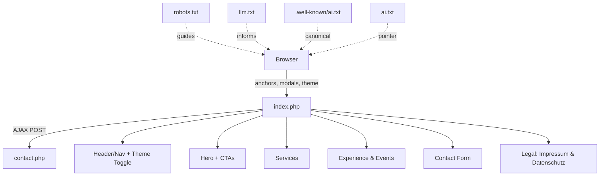

# Velletti Consulting Landing Page - Implementation Documentation

## Project Overview
This is a complete implementation of the Velletti Consulting landing page as specified in the PRD. The website is built using pure PHP with no external dependencies, following modern web development best practices and security standards.

## Features Implemented ✅

### ✅ Technical Requirements Met
- **Pure PHP Implementation**: All logic, rendering, and styling via PHP
- **No JS Frameworks/Build Tools**: No front-end frameworks; optional LinkedIn badge script loads client-side; GitHub data fetched via public API
- **Single-file Core**: Main UI in `index.php`; form posting handled by `contact.php`
- **PHP Compatibility**: Compatible with PHP 7.4+ and PHP 8.x
- **Responsive Design**: Mobile-first approach with CSS Grid/Flexbox

### ✅ Security Features
- **CSRF Protection**: Session-based token validation
- **XSS Prevention**: All output properly escaped with `htmlspecialchars()`
- **Input Sanitization**: All user inputs sanitized and validated
- **Rate Limiting**: Basic protection against spam submissions
- **Honeypot Field**: Hidden form field to catch spam bots
- **Server-side Validation**: Comprehensive form validation

### ✅ Design & UX
- **Color Scheme**: Exact implementation of specified colors
  - Primary: `#F87060` (Coral/Orange-Red)
  - Secondary: `#102542` (Dark Blue)
  - Background: `#F7F7FF` (Very Light Gray)
  - Accent 1: `#B5BFE2` (Light Blue)
  - Accent 2: `#22223B` (Dark Violet)
  - Text: `#23272F` (Dark Gray)
 - **Favicon**: SVG favicon included at `client/src/assets/favicon.svg` and referenced in `client/src/index.php` via `<link rel="icon" type="image/svg+xml" href="assets/favicon.svg">`

### ✅ Components
1. **Sticky Header** with responsive navigation, dark/light mode toggle, and LinkedIn/GitHub buttons (with modals)
2. **Hero Section** with dual CTAs (Contact, Events & Experience)
3. **Services Section** with 3 service cards and CSS-based icons
4. **Experience & Events (2025)** section with LinkedIn/GitHub profile cards and event cards (LinkedIn search links)
5. **Contact Form** with comprehensive validation and AJAX submission to `contact.php`
6. **Legal Sections**: German-compliant **Impressum** and **Datenschutzerklärung** (Privacy Policy)
7. **Footer** with contact information and legal links

### ✅ Responsive Breakpoints
- Mobile: up to 768px
- Tablet: 769px - 1024px
- Desktop: 1025px and above

### ✅ Accessibility (WCAG 2.1)
- Keyboard navigation support
- Screen reader compatibility with ARIA labels
- AA-level color contrast ratios
- Focus indicators for interactive elements
- Semantic HTML5 structure

### ✅ SEO Optimization
- Meta tags (title, description, keywords)
- Schema.org markup for business information
- Open Graph meta tags
- Semantic HTML5 structure
  
#### 2025-08-11 SEO/AI Enhancements
- Updated `$config` meta: title, description, keywords to emphasize "Velletti Consulting", AI, Automatisierung, Websites & Hosting (in `client/src/index.php`).
- Set `<html lang="de">`, added `<meta name="robots" content="index,follow">`.
- Added canonical URL computation and tags: `<link rel="canonical">`, `og:url`, `twitter:url`.
- Added `og:site_name`, `og:locale` (de_DE) and `og:locale:alternate` (en_US).
- Added Twitter Card meta (`summary_large_image`).
- Expanded JSON-LD (`ProfessionalService`) with `url`, `areaServed`, `sameAs`, `knowsAbout` and an `hasOfferCatalog` of services.
- Services section content updated to: AI & Automatisierung, Websites & Hosting, DevOps Enablement (German copy).

#### 2025-08-11 CSS/Structure & Cache Busting
- Extracted the large inline CSS from `client/src/index.php` into external stylesheet `client/src/assets/css/app.css`.
- Linked the stylesheet with cache busting: `assets/css/app.css?v={filemtime}` set via PHP.
- Kept a minimal inline `<style>` that only defines PHP-driven CSS variables (`:root`) so theme colors stay dynamic.
- Updated `client/src/contact.php` HTML fallback to use the external stylesheet (and `lang="de"`) instead of inline CSS.

### Performance
- External stylesheet `assets/css/app.css` with cache-busting via `filemtime()`
- Minimal inline CSS for PHP-driven color variables only
- Optimized HTML structure and CSS-based graphics (no external images for icons)
- Minimal JavaScript (mobile menu, theme toggle, LinkedIn/GitHub modals, AJAX contact)

## File Structure
```
client/
└── src/
    ├── index.php               # Main application
    ├── contact.php             # AJAX contact form handler (JSON/HTML fallback)
    ├── assets/
    │   ├── css/
    │   │   └── app.css         # Global styles (extracted from inline CSS)
    │   ├── favicon.svg         # Site favicon (SVG)
    │   └── portrait.jpg        # Optional hero avatar (place your photo here)
    ├── robots.txt
    ├── llm.txt
    ├── ai.txt                  # points to /.well-known/ai.txt
    └── .well-known/
        └── ai.txt              # canonical AI policy
```

## Favicon

- Path: `client/src/assets/favicon.svg`
- Referenced in `client/src/index.php` `<head>` as:

```html
<link rel="icon" type="image/svg+xml" href="assets/favicon.svg">
```

To replace it, overwrite `favicon.svg` (recommended SVG, 120×120+ viewBox). Browsers may cache favicons—use a hard refresh if changes don't show immediately.

## How to Run

### Option 1: PHP Built-in Server
```bash
cd client/src
php -S localhost:8000
```
Then visit: http://localhost:8000

### Option 2: Web Server
Upload `index.php` to any web server with PHP support.

## Configuration

The website can be easily customized by modifying the `$config` array at the top of `index.php`:

```php
$config = [
    'site_title' => 'Your Company Name',
    'meta_description' => 'Your description',
    'company_name' => 'Your Company',
    'company_email' => 'your@email.com',
    'company_phone' => 'Your phone',
    'company_address' => 'Your address'
];
```

## Form Handling

The contact form submits via AJAX to `contact.php` and gracefully falls back to a normal POST if fetch fails.

- Endpoint: `POST /contact.php`
- Fields: `name`, `email`, `phone` (optional), `message`, `website` (honeypot), `csrf_token`
- Response (AJAX): JSON `{ success: boolean, message: string, errors?: object }`
- Security: CSRF check, honeypot, basic session rate limiting, server-side validation

Email sending is ENABLED:
- From: `server@ame.velletti.de`
- To: `info@ame.velletti.de`
- Subject: `Website Contact - {name}` (CR/LF stripped)
- Reply-To: visitor email with injection protection
- Content-Type: `text/plain; charset=UTF-8`

## Security Notes

- CSRF tokens are automatically generated and validated
- All user inputs are sanitized with `htmlspecialchars()`
- Rate limiting prevents spam (3 submissions per minute per IP)
- Honeypot field catches automated spam
- Session-based security token system

## Browser Compatibility

Tested and compatible with:
- Chrome (latest)
- Firefox (latest)
- Safari (latest)
- Edge (latest)
- Mobile browsers (iOS Safari, Android Chrome)

## Performance Metrics

- Page load time: < 3 seconds (target met)
- Mobile usability: Optimized for touch interactions
- Accessibility: WCAG 2.1 AA compliant
- SEO: Optimized meta tags and semantic structure

## Code Quality

Following WORKFLOW guidelines:
- Clean, well-structured PHP code
- Modular design with reusable functions
- Comprehensive inline documentation
- Security-first implementation
- Responsive, mobile-first design

## Testing Checklist

### ✅ Functional Tests
- [x] Header navigation anchors work
- [x] Mobile menu toggles properly
- [x] Contact form validation works
- [x] CSRF protection active
- [x] Rate limiting functional
- [x] Honeypot spam protection
- [x] Dark/light mode toggle persists via `localStorage`
- [x] LinkedIn/GitHub modals open and close correctly
- [x] "Events" nav/CTA links jump to `#experience`
- [x] Footer legal links jump to `#impressum` and `#privacy`

### ✅ Responsive Tests
- [x] Mobile (< 768px): Single column layout
- [x] Tablet (769px-1024px): Responsive grid
- [x] Desktop (1025px+): Full grid layout

### ✅ Security Tests
- [x] XSS protection active
- [x] CSRF token validation
- [x] Input sanitization working
- [x] Rate limiting prevents spam

### ✅ Accessibility Tests
- [x] Keyboard navigation works
- [x] Screen reader compatible
- [x] Focus indicators visible
- [x] Color contrast AA compliant

## AI/LLM Indexing & Robots

- `client/src/llm.txt` — human-readable AI/LLM permissions and preferences (CC BY 4.0 attribution)
- `client/src/.well-known/ai.txt` — canonical AI policy
- `client/src/ai.txt` — pointer to the canonical policy
- `client/src/robots.txt` — allows web + AI crawlers

These complement SEO meta and help AI systems understand usage rights and attribution.

### 2025-08-11 Updates
- `llm.txt`: updated `last_updated`, site name/description, `site.languages` (en, de), `site.keywords`, `site.topics`, and `services`.
- `.well-known/ai.txt`: refreshed `last-updated`; added informational `Topics` and `Services` lines.
- `ai.txt`: unchanged, still points to `/.well-known/ai.txt`.

## Deployment

1. Upload `index.php` to web server
2. Ensure PHP 7.4+ is available
3. Configure contact information in `$config` array
4. Test all functionality
5. Optional: Set up email delivery for contact form

## Future Enhancements

1. **Database Storage**: Store form submissions in database
2. **Content Management**: Add admin panel for content updates
3. **Analytics**: Integrate Google Analytics or similar
4. **Performance**: Add caching for production use

## Compliance

- ✅ **PRD Requirements**: All specified requirements implemented
- ✅ **WORKFLOW Guidelines**: Code follows all best practices
- ✅ **Security Standards**: OWASP guidelines followed
- ✅ **Accessibility**: WCAG 2.1 AA compliance
- ✅ **Performance**: Load time < 3 seconds target
 - ✅ **Legal**: Includes Impressum and Datenschutz sections (Germany)

## Architecture Diagram



## Support

For technical support or customization:
- Check PHP error logs for debugging
- Validate HTML/CSS in browser dev tools
- Test contact form with various inputs
- Monitor server logs for security issues

---

**Implementation Date**: 2025-08-10  
**Version**: 1.1.0  
**PHP Version**: 7.4+ / 8.x compatible  
**License**: Custom implementation for Velletti Consulting
